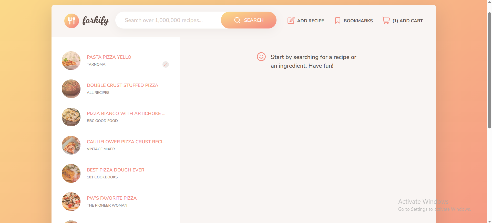

# 🍽️ Forkify Project

**Forkify** is a modern recipe web application that allows users to search for meals, view detailed cooking instructions, upload custom recipes, and manage a personal cart.



---

## 💡 Project Overview

This project is built as part of a learning journey in modern JavaScript development. It consumes the **Forkify API** to fetch recipe data, and provides a dynamic, responsive UI. Users can search for recipes, bookmark favorites, upload their own creations, and even add recipes to a shopping-style cart using browser localStorage.

---

## 🚀 Features

- 🔍 Search recipes from the Forkify API
- 📄 View detailed ingredients and cooking steps
- 📝 Upload custom recipes (form validation included)
- 💾 Persist bookmarks and cart items in localStorage
- 🛒 Cart system to collect selected recipes
- 📱 Responsive design for all devices
- ⏳ Loading spinners and smooth UI feedback

---

## 🛠️ Tech Stack

- **JavaScript (ES6+)**
- **HTML5**
- **SCSS/CSS3**
- **Parcel bundler**
- **Forkify API**

---

## 📦 How to Run

1. **Clone the repository:**

```bash
git clone https://github.com/TarneemMagdy/forkify-Tarneem-Magdy.git
cd forkify
